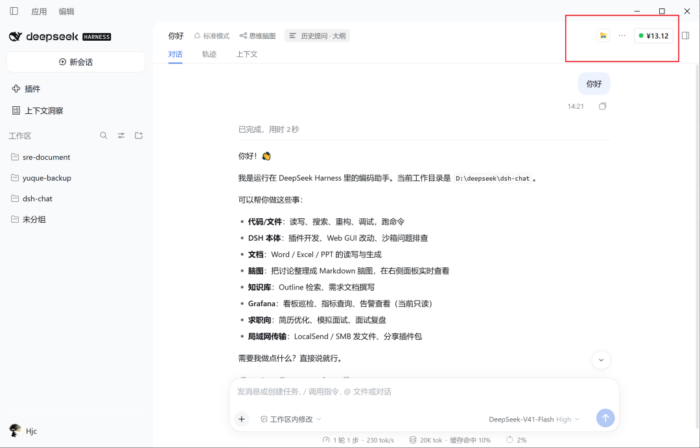

# @deepseek-ai/dsh-client-ui-balance

中文 | [English](README.en.md)

> ✅ **状态：可用**（已在 dsh `0.1.7-rc.2` 实测，并适配 dsh 0.2.x）

DeepSeek 平台账户余额展示：向会话标题栏工具区（`conversation.session.header.utilities`）贡献一个入口——与会话其他工具胶囊并排的紧凑余额胶囊，以及可展开的明细面板。胶囊位于标题栏的 flex 行内，因此不会与相邻的会话工具重叠。

## 数据是怎么来的

余额取自 DeepSeek 官方接口 `GET https://api.deepseek.com/user/balance`。

浏览器**无法**直接调用它，原因有两个，彼此独立：

1. **跨域** —— 该接口不允许跨域读取，页面里的 `fetch` 在读到任何字节之前就会被拦下。
2. **密钥不能进页面** —— Key 由「设置」存入宿主的凭据服务并按引用（`DEEPSEEK_API_KEY`）寻址；把它下发给浏览器等于让每次页面加载都携带一个本机密钥。

因此本包是 **host + client 双半**结构：

| 半 | 职责 |
| --- | --- |
| **host**（`lib/index.js`） | 注册同源路由 `/balance-rpc`；在请求时从凭据服务解析 Key；向 Platform 发起查询；只回传结果 |
| **client**（`lib/client.js`） | 轮询 `fetch('/balance-rpc')`；渲染胶囊与明细面板 |

Key 始终留在宿主进程内，跨越边界的只有投影后的快照。

### 与旧版本的区别

0.3.0 及更早依赖宿主的 `remote.llm.balance()` RPC。该能力在 **dsh `0.1.7-rc.2` 已被移除**（`dsh-llm` 现在只暴露 `listProviders` / `listConfigurableProviders` / `discoverModels`），因此旧版本会**静默失效**：兼容守卫探测到方法缺失后打印一条 `[ui-balance]` 告警并退出，胶囊不再挂载，且没有任何 UI 报错。

0.4.0 不再依赖该 RPC，改由本包自带的 host 半提供数据，从而不再受宿主内部接口变动影响。

## 前置条件

在 dsh **设置 → 偏好设置 → 模型提供方 → 编辑 → 填写 API Key** 中配置 DeepSeek 的 Key（存储为 `DEEPSEEK_API_KEY` 引用）。未配置 Key 时，路由返回 `{ supported: false }`，胶囊显示弱化的占位文案而非报错。

## 刷新策略

- 固定 **60 秒**轮询
- 窗口聚焦、页面恢复可见时立即刷新
- 收到推送失效事件时立即刷新（`credentials/reference-updated`、`llm/adapters-updated`、`connection/reset`）—— 因此改完 Key 无需等待下一个轮询周期
- 每次查询带 **15 秒**超时中止；被新请求取代或组件卸载后的过期响应不会覆盖较新状态

其中 `remote` 仅用于上述事件面，不再是数据路径的一部分：缺少它只会丢掉即时刷新，胶囊照常按周期更新。

## 面板内容

点击胶囊展开：账户可用状态、按币种分行（总额、赠送、充值部分，Platform 披露时显示）、最近更新时间、手动刷新按钮，以及 DeepSeek 平台用量页链接。支持 Esc 或点击面板外部关闭。

## 降级行为

| 情况 | 表现 |
| --- | --- |
| 必需的 `slots` / `locale` 不可用 | 打印一条 `[ui-balance]` 告警并退出，**不挂载**胶囊（不影响同槽位其他工具） |
| `remote` 事件面不可用 | 胶囊正常，仅失去即时失效刷新 |
| 未配置 Key | 胶囊显示弱化占位文案 |
| Key 无效 / 网络不通 / 路由未注册 | 胶囊显示失败状态，原始错误文本即为诊断信息 |

任何异常都被收口在这套逻辑内，**不会**连带拖垮 `conversation.session.header.utilities` 槽位的其他会话标题栏工具。

## 构建说明

`lib/` 是产物。本包 devDependencies 不含 `tsdown`，独立 checkout 默认无法构建。

修改请**同步 `src/` 与 `lib/`**，然后**重启 dsh** 生效（host 半的路由注册发生在启动时）。

## 已知限制

- **仅 DeepSeek** —— 只查询 DeepSeek Platform 账户；其他提供方即使在 dsh 中配置了也不会出现在胶囊里。
- **单一 Key 引用** —— 目前固定从 `DEEPSEEK_API_KEY` 读取，暂未提供配置项指定其他引用名。
- **金额为 Platform 原始字符串** —— 胶囊用 `Intl.NumberFormat` 格式化；`Intl` 无法识别的币种代码回退为 `CODE 金额`。
- **随会话标题栏显示** —— 入口渲染在会话标题栏内，空白会话隐藏标题栏时胶囊也随之隐藏（与其他标题栏工具一致）。

## 模型体验

无：本包仅向人类展示账户状态，不接触任何提示词、消息、模式、流或工具结果。模型对成本的感知仍由 token 计量负责。

### KV 缓存影响

无：本包从不组装或发送模型请求。
